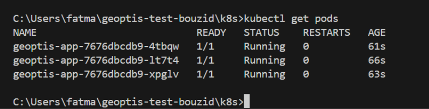
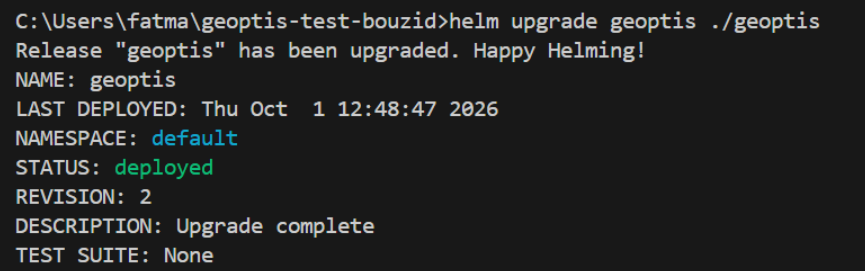
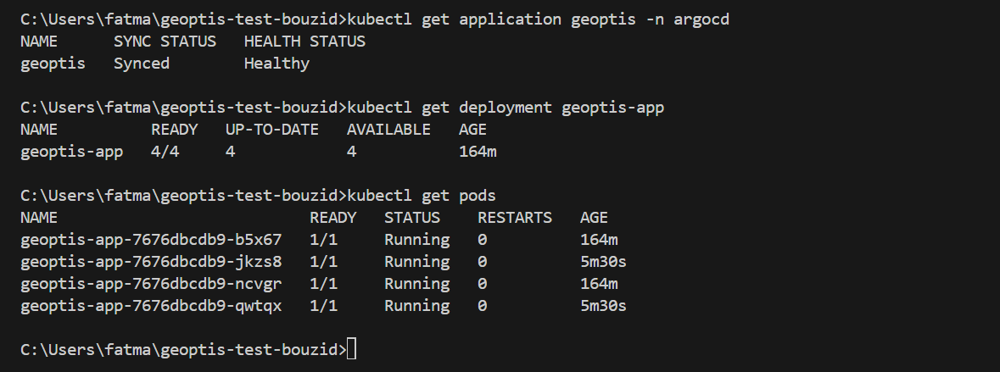
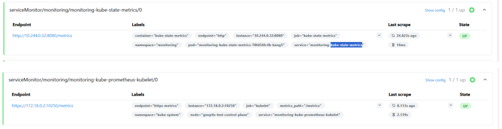
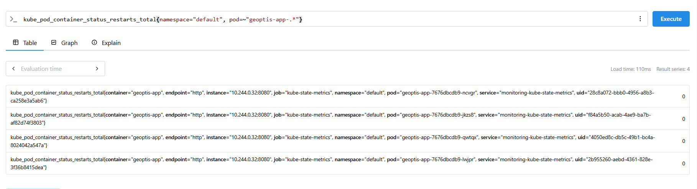
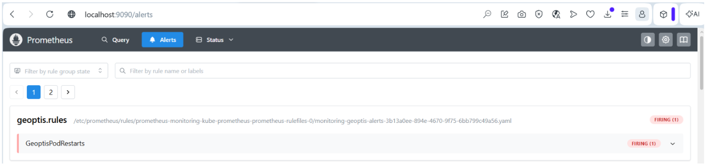

# Test technique Geoptis : Platform Engineer (DevOps & IA)

Candidate : Fatma Bouzid

## Plan
- [x] Étape 0 : mise en place
- [x] Étape 1 : Déployer une application Node.js simple
- [x] Étape 2 : Empaqueter l'app en chart Helm
- [x] Étape 3 : Premier déploiement GitOps avec ArgoCD
- [x] Étape 4 : Monitoring et alerting
- [ ] Étape 5 (bonus) : Conception d'un script assisté par IA

## Étape 0 : mise en place

J'ai installé kind, créé mon cluster local (`geoptis-test`) et ce dépôt. Le nœud est bien `Ready`, donc tout est prêt pour la suite.

**Problèmes rencontrés**

J’ai rencontré un problème de DNS lié au réseau Wi-Fi utilisé, ce qui empêchait Docker de récupérer certaines images. Après avoir réglé le problème, le cluster a été créé correctement et le nœud était `Ready`.

**Ce que j'en retiens**

kind fait tourner Kubernetes dans des conteneurs Docker, donc si Docker va mal, tout va mal. Et quand il y a un souci réseau, je commence par chercher si ça vient de Windows ou de Docker.

## Étape 1 : Déployer une application Node.js simple

J'ai créé une petite application Node.js avec Express qui expose une route `GET /` et retourne `Hello from Geoptis test`.

J'ai créé une image Docker à partir d'un `Dockerfile`, puis je l'ai chargée dans le cluster kind avec `kind load docker-image`.

Côté Kubernetes, j'ai créé un `Deployment` avec 3 replicas ainsi qu'un `Service` de type `ClusterIP`.

Les 3 pods sont bien en état `Running` et le Service possède bien les 3 endpoints.



J'ai ensuite testé l'accès à l'application depuis le cluster avec une requête HTTP et obtenu :

`Hello from Geoptis test`

### Ce que j'en retiens

J'ai mieux compris le fonctionnement d'un Deployment Kubernetes avec plusieurs replicas, ainsi que le rôle d'un Service pour permettre l'accès aux pods.

J'ai également appris à vérifier l'état des pods, les endpoints d'un Service et à tester la communication entre les ressources du cluster.

## Étape 2 : Empaqueter l'application avec Helm

J'ai transformé les manifests Kubernetes de l'étape 1 en un chart Helm simple.

Le chart contient :
- `Chart.yaml`
- `values.yaml`
- `templates/deployment.yaml`
- `templates/service.yaml`

Dans `values.yaml`, j'ai rendu configurables :
- le nombre de réplicas
- le tag de l'image Docker

Avant l'installation du chart, j'ai supprimé les anciennes ressources Kubernetes créées directement avec `kubectl` à l'étape 1, afin de laisser Helm créer et gérer ses propres ressources.

J'ai vérifié le chart avec `helm lint`, puis je l'ai installé avec `helm install` avec 3 réplicas.

Ensuite, j'ai modifié `replicaCount` de 3 à 2 dans `values.yaml` et utilisé `helm upgrade`. Le Deployment est bien passé à 2 pods en fonctionnement.




### Ce que j'ai appris

Helm permet de regrouper les manifests Kubernetes dans un chart et de rendre certaines valeurs configurables avec `values.yaml`. Cela évite de modifier directement les fichiers YAML à chaque changement. Par exemple, je peux changer le nombre de réplicas ou le tag de l'image puis utiliser `helm upgrade` pour appliquer la modification.

## Étape 3 : Premier déploiement GitOps avec ArgoCD

Cette étape était nouvelle pour moi. J'ai suivi le guide officiel d'ArgoCD.

### Installation

```bash
kubectl create namespace argocd
kubectl apply -n argocd --server-side --force-conflicts -f https://raw.githubusercontent.com/argoproj/argo-cd/stable/manifests/install.yaml
```

Juste après, plusieurs pods étaient en `CreateContainerConfigError`. Avec `kubectl describe pod`, j'ai vu `secret "argocd-redis" not found` : le secret n'était simplement pas encore créé. Après quelques minutes, tous les pods étaient en `Running`.

### L'Application ArgoCD

J'ai écrit `argocd/application.yaml`. Elle pointe vers mon dépôt, sur le dossier `geoptis` (le chart de l'étape 2), avec la synchronisation automatique :
- `prune: true` supprime du cluster ce qui n'est plus dans Git
- `selfHeal: true` remet le cluster dans l'état de Git si quelqu'un le modifie à la main

Après `kubectl apply -f argocd/application.yaml`, l'application est passée à `Synced` et `Healthy`.

### La boucle GitOps

J'ai passé `replicaCount` de 2 à 4 dans `geoptis/values.yaml`, puis `git commit` et `git push`. Je n'ai ensuite lancé ni `kubectl apply` ni `helm upgrade` : ArgoCD a détecté le changement dans Git et a automatiquement synchronisé l’application. Le Deployment est ensuite passé à 4/4.



### Ce que GitOps change pour moi

Pendant mes stages, j'ai surtout travaillé avec Docker et Docker Compose pour déployer des applications et des outils de monitoring. Quand je voulais changer quelque chose, je modifiais la configuration et je relançais moi-même les conteneurs (`docker compose up -d`). Avec GitOps, je ne touche plus à l'infrastructure : je modifie Git et ArgoCD s'occupe du reste.

Pour une équipe, c'est intéressant parce que :
- tout changement passe par Git, donc on sait qui a changé quoi et quand
- un retour en arrière, c'est un simple `git revert`
- si quelqu'un modifie le cluster à la main, `selfHeal` le remet dans l'état voulu

## Étape 4 : Monitoring et alerting

J'ai installé `kube-prometheus-stack` avec Helm dans un namespace `monitoring`. Prometheus récupère tout seul les métriques de base des pods (CPU, redémarrages), sans rien ajouter dans mon application. Dans son interface, les cibles `kubelet` et `kube-state-metrics` sont bien en `UP`.



J'ai écrit une règle d'alerte (`monitoring/geoptis-alert.yaml`) qui se déclenche quand un pod `geoptis-app-*` redémarre plus de 2 fois en 5 minutes. Elle porte le label `release: monitoring`, sans lequel Prometheus ne la charge pas.



Pour la déclencher, j'ai d'abord essayé de tuer le process de mon application avec `kill 1`, sans effet : dans un conteneur, ce process est le PID 1 et le noyau ignore les signaux qu'on lui envoie depuis l'intérieur. J'ai donc créé un pod de test qui plante en boucle, avec un nom qui correspond à ma règle. Il est passé en `CrashLoopBackOff` et l'alerte est passée à `Firing`. Mon application n'a pas été touchée.



### Problèmes rencontrés

Au démarrage, l'operator Prometheus a redémarré plusieurs fois pendant que les images se téléchargeaient, puis tout s'est stabilisé tout seul. D'autres alertes sont aussi en rouge (`etcd`, `TargetDown`) : c'est normal sur kind, Prometheus ne peut pas joindre certains composants du cluster.

### Ce que j'en retiens

C'est le même principe que dans mon stage : une métrique, un seuil, une durée. La différence, c'est que tout est décrit en YAML, et qu'il vaut mieux tester une alerte avec un pod dédié plutôt que de casser l'application.